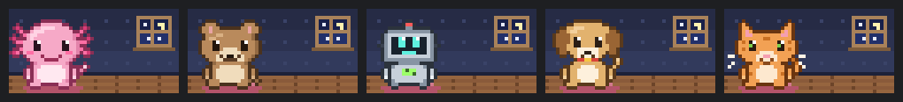

# Desk Pet

A small animated pet that lives beside your Claude Code session and reacts to what Claude is doing, so long sessions are more fun to glance at.



Pick an **axolotl**, **quokka**, **tiny robot**, **dog** or **cat**. Each one has its own take on every reaction.

| When | Your pet |
|---|---|
| A turn starts | wakes up and stretches |
| Claude reads files | reads a tiny book, flipping pages faster for big files |
| Claude edits code | hammers (quokka, robot, dog) or knits (axolotl, cat) |
| Claude runs a shell command | types furiously at a mini keyboard |
| Claude searches or fetches the web | peers through binoculars |
| Tests pass | dances in a shower of confetti |
| Tests fail | hides behind a rock, then peeks out |
| A turn runs 5+ minutes | gets bored: yawns, plays with yarn, builds a sandcastle |
| Claude needs your input | waves until you respond |
| A turn finishes | brings you a little trophy or envelope |
| Context compaction | tidies its room, stacking boxes |
| Nothing happening | breathes and blinks |

Your pet lives in a little pixel room (wallpaper, a night window, a wooden floor and a rug). It's drawn with half-block pixels in the terminal (48 columns by 12 rows) and as an animated SVG in the Claude desktop app.

You choose where it sits:

- **Side panel** (default): its own panel beside the conversation, with the pet's name, what it's doing and a settings button. If you close it, `/desk-pet show` brings it back. A terminal opens the panel by itself only when it's at least 144 columns wide.
- **Above the prompt**: a compact card at the right edge, just above the message box.
- **Under the prompt**: a tiny pet beside the hint line under the message box in the desktop app, or a one-line caption at the end of that line in the terminal.

## Install

In Claude Code, add this repository as a plugin marketplace, then install the plugin:

```
/plugin marketplace add isr431/desk-pet
/plugin install desk-pet@desk-pet
```

Or from a shell:

```bash
claude plugin marketplace add isr431/desk-pet
claude plugin install desk-pet@desk-pet
```

Start a new session and your pet appears. Run `/desk-pet` to pick your pet and settings.

Desk Pet is a function-hooks plugin. It needs Claude Code 2.1.286 or newer. The function-hooks API is early access, so a future release may change it.

To try it from a local checkout without installing:

```bash
claude --plugin-dir /path/to/desk-pet
```

## Settings

- **Pet**: axolotl (default), quokka, robot, dog or cat.
- **Position**: side panel (default), above the prompt, or under the prompt.
- **Sound**: off by default. When on, a soft chime plays when Claude needs input and when a turn finishes. Both chimes are synthesized in code; no audio files are shipped.
- **Reactions**: each one can be switched on or off. All are on by default.

You can change these in three places:

- `/desk-pet` opens a settings pane with a preview button for each reaction.
- `/desk-pet cat` (or `axolotl`, `quokka`, `robot`, `dog`) switches pets.
- `/desk-pet show` reopens the side panel.
- `/config` in the terminal lists every setting as a "Desk Pet: …" row.

`/desk-pet demo` plays every reaction in turn, which is handy for a screenshot or a GIF.

## How it decides what to show

- Tests are detected from the shell command (`npm test`, `pytest`, `go test`, `cargo test`, `vitest`, `jest`, `rspec` and similar). A non-zero exit counts as a failure.
- "Needs input" covers permission prompts, MCP elicitations, `AskUserQuestion` and plan approval. The pet stops waving when you send a prompt or when the tool call it was waiting on finishes. One known gap: after you approve a long-running command, the pet keeps waving until that command ends, because the hooks API has no event for the moment a prompt is answered.
- Reactions from subagents count too. Only the main conversation's turns trigger wake-up, boredom and the end-of-turn gift.

In the "above the prompt" position, press ctrl+x ctrl+a to collapse the card in the terminal.

## Development

```bash
claude plugin validate .
claude plugin test .
```

The pixel art lives in `hooks/art.ts`. It's plain TypeScript with no engine calls, so you can import it under Node to render previews.

## License

MIT
